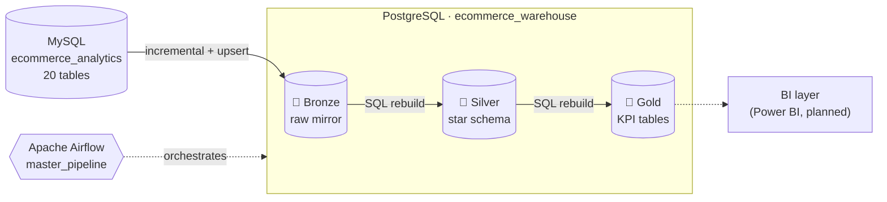
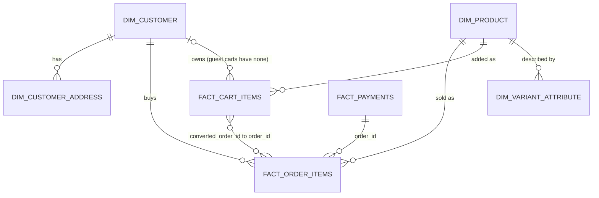
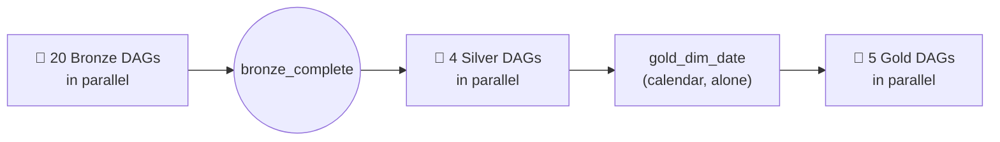

<div align="center">

# 🏗️ E-Commerce Medallion Data Warehouse

**A Bronze → Silver → Gold data warehouse built with Apache Airflow, MySQL and PostgreSQL.**
Idempotent loads, a star schema, and KPI tables that reconcile to the source with zero difference.


</div>

---

## ✨ Highlights

| | |
|---|---|
| 🔁 **Re-runnable by design** | Every load is an upsert, and every rebuild is a single transaction. A retry or a crash never duplicates or loses data. |
| 🎯 **Right loader for each table** | Four extraction strategies, chosen by how each table actually behaves (full reload, batched upsert, ID watermark, compound timestamp watermark). |
| ⭐ **Star schema in Silver** | 7 facts and dimensions with documented grain, built once so every KPI starts from the same model. |
| 📊 **Business-ready Gold** | 6 KPI tables that store only additive measures, so BI can roll them up to any level. |
| ✅ **Proven correct** | Every layer is reconciled to the one below with a zero difference, and a full re-run leaves every Gold table unchanged. |
| 🧭 **Orchestrated end to end** | One `master_pipeline` DAG runs Bronze, then Silver, then Gold, each phase gated on the one before. |

> 📖 **Want the reasoning behind every design choice?** Read **[PROJECT_DECISIONS.md](PROJECT_DECISIONS.md)**: each decision with its "why", the alternative rejected, and what breaks if you skip it.

---

## 🗺️ Architecture



### What each layer does

| Layer | Job | Refresh | Tables |
|---|---|---|---|
| 🥉 **Bronze** | A faithful copy of the source plus tracking columns. No cleaning. | Incremental or upsert | 20 |
| 🥈 **Silver** | Facts and dimensions with a defined grain. Joins done once. | Full rebuild (pure SQL) | 7 |
| 🥇 **Gold** | Pre-aggregated KPIs for reporting | Full rebuild in one transaction | 5 + `dim_date` |

---

## 🧰 Tech stack

| Area | Technology |
|---|---|
| Orchestration | Apache Airflow 2.10.3 (`PythonOperator`, `TriggerDagRunOperator`, DAG-factory pattern) |
| Language | Python 3.12 and SQL |
| Source | MySQL (read-only) |
| Warehouse | PostgreSQL, schemas `bronze`, `silver`, `gold` |
| Connectivity | `apache-airflow-providers-mysql`, `apache-airflow-providers-postgres`, raw `psycopg2` for transactional control |
| Environment | Local virtualenv, no containers |

---

## 🥉 Bronze: raw, replayable, re-runnable

Each of the 20 source tables is loaded with the **cheapest strategy that is still correct** for how that table behaves:

| Pattern | Tables | How it works | Why |
|---|---|---|---|
| **Full reload** | 10 small reference tables | `TRUNCATE` + `INSERT` in one transaction | Under 1,000 rows, so simple wins |
| **Batched upsert** | `orders`, `payments` | Re-read in 10,000-row batches, `ON CONFLICT DO UPDATE` | Rows change (order status) but there is no `updated_at` |
| **ID watermark** | `order_items`, `customers`, `customer_addresses`, `products`, `product_variants` | `WHERE pk > last_id`, `ON CONFLICT DO NOTHING` | Rows never change after creation |
| **Compound timestamp watermark** | `carts`, `cart_items` | `WHERE (updated_at, pk) > (last_ts, last_id)` | Rows change, and timestamps repeat (see below) |

**Safety rules** applied everywhere:

- **Commit the data first, then move the watermark**, per batch. A crash costs at most one batch and never skips rows.
- **Upserts everywhere**, so a retry is always safe.
- **Tracking columns** on every table: `_ingested_at`, `_source_system`, `_batch_id`.
- **Audit tables**: `bronze.etl_metadata` (watermarks) and `bronze.etl_log` (one row per run, `RUNNING` → `SUCCESS` / `FAILED`).

---

## 🥈 Silver: the star schema



| Table | Grain (one row per…) | Rows |
|---|---|---|
| `dim_customer` | customer, with the default address flattened in | 200,000 |
| `dim_customer_address` | address (full history of every address) | 400,225 |
| `dim_product` | **variant** (the sellable unit), with category, brand and current tax rate | 319 |
| `dim_variant_attribute` | variant and attribute (size, color, … stored as rows) | 679 |
| `fact_order_items` | order **line** | 1,310,429 |
| `fact_payments` | payment | 439,248 |
| `fact_cart_items` | cart item | 5,963,986 |

**Key modelling choices**

- 🔹 **Orders and payments are separate facts.** They have different grains, and merging them would repeat each payment on every order line and inflate totals.
- 🔹 **Product grain is the variant**, since that is what carries the SKU and price.
- 🔹 **Size and color are EAV rows**, so new attribute types need no schema change.
- 🔹 **Customer SCD Type 1**: overwrite, no history, since the source has no change tracking.

---

## 🥇 Gold: KPI tables for BI

All Gold tables store **only sums, counts and dates**. Averages and rates are computed in the BI tool, because they cannot be added up.

| Table | Question it answers | Grain | Rows |
|---|---|---|---|
| `dim_date` | A shared calendar for every report | date | 2,557 |
| `daily_sales_summary` | How much do we sell each day, per channel? | order date × channel | 7,332 |
| `product_performance` | Which products, categories and brands sell? | order date × variant | 291,854 |
| `customer_summary` | What is each customer worth, and when did they last buy? | customer | 200,000 |
| `cart_funnel` | How many carts convert, get abandoned or expire? | cart date × channel | 9,004 |
| `payment_summary` | How do payment methods perform? | order date × channel × method | 27,470 |

**Business rule:** revenue counts only *valid* orders (not `CANCELLED` or `RETURNED`). Cancelled and returned amounts live in their own columns, so they never disturb the real revenue.

### Example queries

```sql
-- Average order value by channel (computed, not stored)
SELECT channel,
       ROUND(SUM(net_revenue) / NULLIF(SUM(total_orders), 0), 2) AS avg_order_value
FROM gold.daily_sales_summary
GROUP BY channel
ORDER BY avg_order_value DESC;

-- Monthly revenue
SELECT d.year_month, ROUND(SUM(s.net_revenue)) AS net_revenue
FROM gold.daily_sales_summary s
JOIN gold.dim_date d USING (date_key)
GROUP BY d.year_month
ORDER BY d.year_month;

-- Cart conversion rate by channel
SELECT channel,
       ROUND(100.0 * SUM(converted_carts) / SUM(total_carts), 2) AS conversion_pct,
       ROUND(100.0 * SUM(abandoned_carts) / SUM(total_carts), 2) AS abandonment_pct
FROM gold.cart_funnel
GROUP BY channel;

-- Top 5 categories by revenue
SELECT category_name, SUM(units_sold) AS units, ROUND(SUM(net_revenue)) AS net_revenue
FROM gold.product_performance
GROUP BY category_name
ORDER BY net_revenue DESC
LIMIT 5;
```

---

## 🎛️ Orchestration

One trigger runs the whole warehouse. Each phase waits for **every** DAG of the previous phase.



| Choice | Reason |
|---|---|
| **Wait for the whole phase** | Silver tables join several Bronze tables, so "wait for all" is simpler and safer than tracking each dependency |
| **Calendar runs first, alone** | Every other Gold table has a foreign key on `dim_date` |
| **`wait_for_completion=True`** | A failed child DAG blocks the next phase, so Gold never builds on incomplete data |
| **Deferrable triggers** | Waiting hands off to the triggerer and frees the executor slot (required on `SequentialExecutor`) |

A full run takes about **12 minutes** on a laptop with a single executor slot.

---

## ✅ Verified results

| Check | Result |
|---|---|
| Bronze row counts vs MySQL | Identical (439,248 orders, 1,310,429 order items, 2,000,000 carts, 5,963,986 cart items) |
| Silver row counts vs Bronze | Identical for all 7 tables |
| Gold revenue vs Silver `line_total` | **0 difference** |
| Net revenue across daily, product and customer tables | All three equal **9,646,472,767.95** |
| Cart and payment totals vs Silver | **0 difference** |
| Full re-run with unchanged source | Every Gold table identical before and after |
| Run log | 20 Bronze, 7 Silver and 6 Gold runs, all `SUCCESS`, in phase order |

---

## 🐛 Problems solved along the way

| Problem | Cause | Fix |
|---|---|---|
| **Silent data loss** in `cart_items` (200K of 5.9M rows loaded) | A strict `updated_at >` watermark skipped every row sharing a timestamp (128,099 rows on one day) | Compound `(updated_at, id)` watermark |
| **Duplicate rows after a retry** | A separate `TRUNCATE` step ran before a batched load | Removed the truncate and made every batch an upsert |
| **MySQL `tinyint(1)` rejected by Postgres `boolean`** | No implicit int → boolean cast | Explicit cast helper before insert |
| **A 30+ minute Silver rebuild** | 200,000 `LATERAL` lookups with no index on `customer_id` | Partial index; the run dropped to about 5 seconds |
| **Master DAG would not load** | `list >> list` dependency is unsupported in Airflow | A no-op barrier task between phases |
| **Master DAG would deadlock** | `SequentialExecutor` has one slot and a waiting trigger held it | Deferrable triggers plus a triggerer process |

---

## 🚀 Getting started

### Prerequisites

- Python 3.12, PostgreSQL, and a MySQL source database `ecommerce_analytics`
- On Ubuntu, the build libraries for the MySQL driver:

```bash
sudo apt install -y build-essential pkg-config libmysqlclient-dev
```

### 1. Install

```bash
git clone <your-repo-url>
cd ecommerce-medallion

python3 -m venv .venv
source .venv/bin/activate

pip install "apache-airflow==2.10.3" \
  --constraint "https://raw.githubusercontent.com/apache/airflow/constraints-2.10.3/constraints-3.12.txt"
pip install apache-airflow-providers-mysql apache-airflow-providers-postgres
```

### 2. Configure Airflow

```bash
export AIRFLOW_HOME="$(pwd)/airflow_home"
airflow db migrate

airflow users create --username admin --firstname Admin --lastname User \
  --role Admin --email admin@example.com --password '<choose-a-password>'

airflow connections add mysql_source \
  --conn-type mysql --conn-host <mysql-host> --conn-port 3306 \
  --conn-login <user> --conn-password '<password>' --conn-schema ecommerce_analytics

airflow connections add postgres_warehouse \
  --conn-type postgres --conn-host localhost --conn-port 5432 \
  --conn-login <user> --conn-password '<password>' --conn-schema ecommerce_warehouse
```

### 3. Create the warehouse

```bash
createdb ecommerce_warehouse

# run in this order; within gold/, create dim_date first (other tables reference it)
for f in sql-scripts/init/*.sql sql-scripts/bronze/*.sql sql-scripts/silver/*.sql sql-scripts/gold/*.sql; do
  psql -d ecommerce_warehouse -f "$f"
done
```

> If your Gold scripts are not sorted so that `dim_date` comes first, run that file by hand before the loop.

### 4. Start Airflow (three terminals, same `AIRFLOW_HOME`)

```bash
airflow webserver --port 8080
airflow scheduler
airflow triggerer          # required: the master uses deferrable triggers
```

### 5. Un-pause and run

New DAGs start paused, and **a triggered run of a paused DAG never starts**, so un-pause everything first:

```bash
for d in $(airflow dags list 2>/dev/null | awk '{print $1}' | grep -E '^(bronze_|silver_|gold_|master_pipeline)'); do
  airflow dags unpause "$d"
done

airflow dags trigger master_pipeline
```

Open <http://localhost:8080> and watch the Grid view. When all tasks are green, check the run log:

```sql
SELECT layer, status, COUNT(*) AS runs
FROM bronze.etl_log
GROUP BY layer, status
ORDER BY layer;
```

---

## 📁 Project structure

```
ecommerce-medallion/
├── airflow_home/
│   └── dags/
│       ├── bronze/          # 20 Bronze DAGs (DAG-factory files)
│       ├── silver/          # 4 Silver DAGs (7 tables)
│       ├── gold/            # gold_dim_date + 5 Gold DAGs
│       └── pipelines/       # master_dag.py → master_pipeline
├── sql-scripts/
│   ├── init/                # schemas, etl_metadata, etl_log
│   ├── bronze/              # Bronze DDL, primary keys, indexes
│   ├── silver/              # Silver DDL
│   └── gold/                # Gold DDL
├── PROJECT_DECISIONS.md     # the "why" behind every decision
└── README.md
```

---

## 🛣️ Roadmap and known limits

| Item | Status |
|---|---|
| Change data capture (Debezium + Kafka) for `orders` and `payments` | Not built, documented as future work |
| Incremental Silver and Gold instead of full rebuilds | Planned for when volume grows |
| Geography dimension (sales by state or city) | Needs a small Silver addition first |
| Automated reconciliation checks as Airflow tasks | Currently manual SQL |
| Fail-fast check for paused DAGs in the master | Idea |
| `LocalExecutor` with a Postgres metadata database | Would remove the one-task-at-a-time limit |
| BI layer (Power BI) and the Citus, TimescaleDB and ClickHouse stores | Theory only |

The source data is synthetic: conversion, abandonment and payment-success rates are nearly identical across channels, so treat those figures as demo data, not business insight.

---

## 👤 Author

**`Prem Choithani`** · [GitHub](https://github.com/prem-choithani23) · [LinkedIn](https://www.linkedin.com/in/prem-choithani-937a27340)

<!-- Add a screenshot of the Airflow Grid view here for extra polish:

-->
