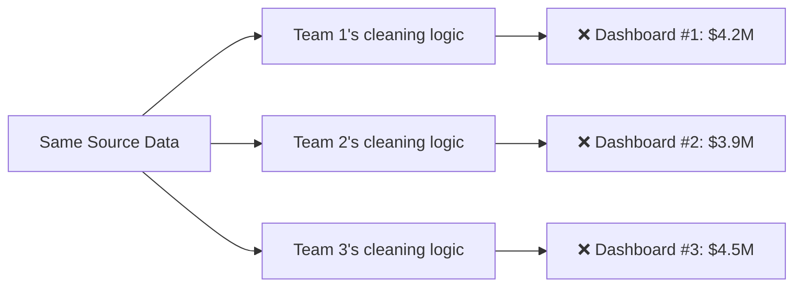
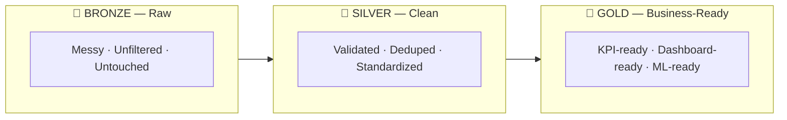
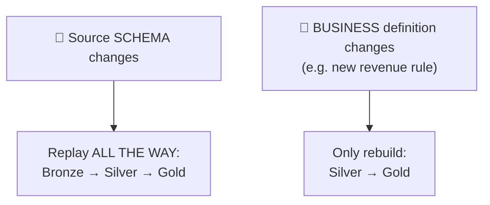
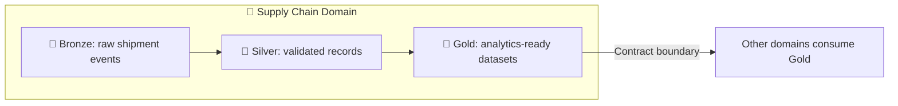
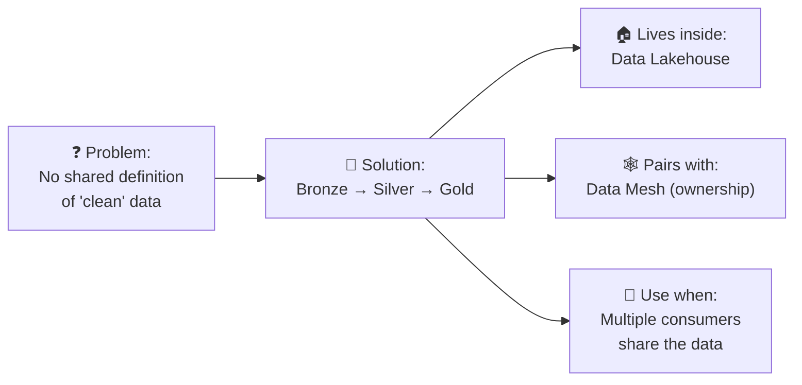

    # 🏅 Medallion Architecture — Complete Notes

> *Based on: "What Is Medallion Architecture? Bronze, Silver, and Gold Layers Explained" (DataCamp, Sep 2026) — by Srujana Maddula & Tom Farnschläder*

```
🥉 BRONZE  ──▶  🥈 SILVER  ──▶  🥇 GOLD
  raw data        clean data      business-ready data
```

---

## 📌 1. The Problem It Solves

> **Scenario:** Five teams. Same source data. Five *different* revenue numbers for the same quarter. 😬

The issue isn't broken source data — it's that **nobody agreed on what "clean" means**. Every team cleans, filters, and joins the data their own way.



**Medallion architecture fixes this** by giving everyone **shared, explicit checkpoints** for refining data — so the whole company builds from the same trusted version, while the original raw data is never thrown away.

> 🍳 **Analogy:** Instead of every chef washing, chopping, and seasoning ingredients their own random way, there's one shared prep station everyone uses first. Consistent results, no matter who's cooking.

---

## 🧱 2. What Is Medallion Architecture?

**Definition:** A way of organizing data inside a **data lakehouse** into three layers, each one cleaner and more refined than the last.



| Layer | Nickname | Holds... |
|:---:|---|---|
| 🥉 **Bronze** | Raw layer | Data exactly as it arrived |
| 🥈 **Silver** | Contract layer | The "single source of truth" |
| 🥇 **Gold** | Business layer | Ready for dashboards / reports / ML |

> 🍽️ **Simple memory hook:** Bronze = raw ingredients · Silver = prepped ingredients · Gold = the finished dish.

---

## ⚖️ 3. Medallion (ELT) vs. Traditional ETL

<table>
<tr><th>🏛️ Traditional ETL</th><th>🏗️ Medallion-based ELT</th></tr>
<tr><td>

- Schema defined **upfront**
- Transform **before** loading
- Unexpected format change ⟶ pipeline **breaks**
- Raw version is usually **lost**

</td><td>

- Schema decided **later** (enforced in Silver)
- Transform **after** loading
- Raw data always preserved ⟶ **flexible & resilient**
- You decide how to use data *later*

</td></tr>
</table>

### 📊 Side-by-Side Comparison

| Feature | 🏗️ Medallion (ELT) | 🏛️ Traditional ETL |
|---|---|---|
| Raw data | ✅ Preserved | ❌ Gone |
| Schema | Decided later, enforced in Silver | Defined upfront |
| Reprocessing | Easy — replay from Bronze | Often needs re-extracting from source |
| Transform timing | After loading | Before loading |
| Refinement | Progressive, across layers | Mostly one-shot, before storage |

> 💡 **Bonus fact:** Medallion is **platform-agnostic**. Bronze/Silver/Gold are *logical* stages — not tools. You can build the pattern on Databricks, Snowflake, Microsoft Fabric, plain S3, etc.

---

## 🔍 4. Deep Dive Into Each Layer

### 🥉 Bronze — *The Raw Data / Recovery Point*

| | |
|---|---|
| **What lands here** | Databases, Salesforce, Kafka streams, REST APIs, CSVs, IoT data — exactly as received |
| **Common tools** | Fivetran (change data capture), Databricks Auto Loader (files) |
| **Data quality** | 🚫 Messy — duplicates, errors, inconsistencies. **Never use directly for business decisions.** |
| **Why keep it anyway** | It's your **recovery point** — replay downstream pipelines anytime something breaks |
| **Bonus value** | Stores metadata: ingestion timestamps, data origin, IDs — great for debugging |

> 🛟 **Think of Bronze as insurance.** Keep it messy, complete, and untouched.

---

### 🥈 Silver — *The Contract Layer / Single Source of Truth*

Cleaning tasks that happen here:

- ✂️ Filtering out unnecessary columns
- 🧹 Deduplicating records
- 🔧 Fixing inconsistencies
- ❓ Handling missing values
- 📏 Standardizing formats
- 🔗 Joining/merging datasets

Plus two structural jobs:

1. **Schema enforcement** — data must follow a defined structure (with room for controlled evolution)
2. **Data quality checks** — rules that flag/reject bad transactions or outliers

| Purpose | Tool examples |
|---|---|
| Tracking transformations (lineage) | **dbt** |
| Automated quality checks | **dbt tests, Great Expectations, Soda** |
| Governance / cataloging | **Databricks Unity Catalog, Collibra** |

> ✅ **Silver = the one trustworthy version everyone should build from.** It's *use-case-independent* — not customized for any single team's dashboard.

---

### 🥇 Gold — *Business-Ready Output*

Since Silver already did the cleaning, Gold is all about **shaping data for a specific purpose**:

| Used for | Examples |
|---|---|
| 📊 BI Dashboards | Power BI, Tableau, Looker |
| 🤖 ML Training | Via feature stores (Feast, Databricks Feature Store) |
| 📈 Reporting | KPIs, custom business formulas, weekly/monthly/quarterly rollups |

> ⚡ **Key distinction:** Bronze & Silver logic looks *similar* across companies (generic ingestion + cleaning). **Gold logic is highly custom** — built around exactly what business question you're answering.

> 🍽️ Gold = the finished, plated dish — ready to serve to a customer (a dashboard, a model, a report).

---

## 🔁 5. Rebuilding Silver & Gold When Things Change

The cost of a fix depends on **where** the problem originates:



| Trigger | What you rebuild | Do you touch the source system? |
|---|---|---|
| Source schema change | Bronze → Silver → Gold (everything) | ❌ No — replay from Bronze |
| Business logic/definition change | Silver → Gold only | ❌ No — Silver is already validated |

> 🎯 **Why this is powerful:** You *never* have to crawl back to the original source system (which might not even hold that historical data anymore). Teams with many Gold consumers can tweak metric definitions freely without disturbing anyone else's pipeline.

> 🍲 **Analogy:** Mislabeled an ingredient? Redo the whole recipe. Want different seasoning on the finished dish? Just redo that last step.

---

## 🏠 6. How Medallion Relates to the Data Lakehouse

> **Data Lakehouse** = cheap, flexible storage (data lake) + transactional reliability (data warehouse).
> **Medallion Architecture** = the *floor plan* for organizing what's inside that lakehouse.

The lakehouse is the **building**. Medallion is the **furniture arrangement plan** — it tells you how to divide storage into Bronze/Silver/Gold using catalogs, schemas, and tables.

| Platform | How it's implemented |
|---|---|
| **Databricks** | 3 schemas inside a Unity Catalog catalog |
| **Microsoft Fabric** | Lakehouse (Bronze + Silver tables) feeding a Gold warehouse |

### 🗂️ Why Open Table Formats Matter

Formats like **Delta Lake, Apache Iceberg, Apache Hudi** make the layers reliable under concurrent reads/writes:

- ✅ ACID transactions
- ✅ Schema evolution
- ✅ Versioned table state
- ✅ Concurrency controls
- ✅ Partition evolution
- ✅ Time travel

> ⚠️ **Why it matters:** Plain raw files (e.g. Parquet) preserve data but have **no history**. A bad Silver run just overwrites the good one — nothing to roll back to. Delta Lake solves this with a **transaction log**; Iceberg uses **snapshots**.

> 🧘 **None of this is mandatory** — medallion is a *logical* pattern. Plenty of teams run it on plain Postgres schemas or S3 prefixes with dbt on top. You just lose the easy rollback safety net.

---

## 🕸️ 7. Medallion Architecture vs. Data Mesh

They get compared often — but they answer **completely different questions**:

| Concept | Answers... |
|:---:|---|
| 🕸️ **Data Mesh** | **WHO** owns the data |
| 🏅 **Medallion Architecture** | **HOW** that owner refines the data |

### Data Mesh in short:
- Ownership goes to **domain teams** (Sales, Finance, Supply Chain...)
- Each domain publishes data as a **product** and owns its quality, lineage, governance
- Held together by: **self-service infrastructure** (same tools for everyone) + **federated governance** (shared standards, no loss of domain ownership)

### How they fit together:



> 📝 The **mesh defines the contract at the Gold boundary**. Everything upstream (Bronze, Silver) is that domain's own business.

> 💸 **Hidden cost to watch for:** Per-domain Bronze layers mean each domain pays its own ingestion/storage cost, and shared data (like "customer" or "product") often gets **rebuilt in multiple places**. Mesh fans call this "the price of ownership" — but it's a real cost worth pricing out first.

---

## ⚖️ 8. Benefits vs. Limitations

> 🎯 **In one line:** Medallion buys you *reuse* and *recoverability* — and charges you in *storage*, *latency*, and *pipeline count*. Worth depends almost entirely on **how many consumers** you have.

| ✅ Benefit | ⚠️ Limitation |
|---|---|
| Raw data stays available for reprocessing/recovery | Same data exists in 2–3 forms → storage grows |
| Explicit quality expectations at each boundary | More tables & jobs to schedule, monitor, debug |
| Many Gold datasets reuse one clean Silver dataset | Every hop adds latency |
| Fully traceable, raw-input to business-output | Hard to justify on one simple pipeline |

### 🐢 Latency — easiest to underestimate
Each layer = its own scheduled job. An hourly 3-layer pipeline can leave Gold **2 hours behind** the source. Fine for a weekly report, *not* fine for a live alert — which is why teams often let alerts read **Silver directly**.

### 💰 Storage — usually the smaller problem
Bronze sits in cheap object storage. Duplication is real, but bounded.

### 🔧 Pipeline count — the *actual* pain point
3 layers × 20 source tables = **60 things that can fail at 3am.**

> 📉 **The flip side:** IBM (2026, based on 2025 research) found **43% of COOs** named data quality their #1 data priority, and **over 25% of organizations** reported annual losses **exceeding $5 million** from poor data quality.

> ❓ **The real question isn't** "does medallion cost more than one pipeline?" (it does) — **it's** "am I already paying for the alternative through reconciliation meetings and dashboards nobody trusts?"

---

## 🚦 9. When Should You Use It?

> **Best predictor:** how many consumers share the same cleaned data — more important than data volume, team size, or number of sources.

### ✅ Use medallion when:
- 👥 Multiple teams/workloads read the **same** data
- 🔀 Different teams need **different shapes** of the same data (Finance: monthly revenue · Sales: daily bookings — both from one Silver table)
- ⚔️ **Sources disagree** with each other (reconcile IDs in Silver before anyone downstream has to guess)
- 🕵️ You need to **defend/trace a number** back through its transformations
- 🔄 **Transformation logic changes often** — preserved Bronze = rebuild without re-touching the source

### ❌ Skip medallion when:
- 🧑‍💻 Small data team, low pipeline complexity
- 1️⃣ Single data source, minimal cleaning needed
- 🎯 Only **one** downstream consumer
- 📋 Simple, straightforward reporting needs

> ### 🪜 When Two Layers Are Enough
> The 3-layer diagram is a **default, not a requirement**. Single use case? **Bronze + one combined Silver/Gold layer** often works fine.
>
> 🚫 **Never collapse away Bronze** — it's the one layer you can't recreate.
>
> 💡 **Practical tip:** Not sure? Start with **two layers**, add Gold later once a **second consumer** shows up. Adding Gold later is *much* cheaper than retrofitting Bronze after months of overwriting raw data.

---

## 🧨 10. Common Mistakes (and Fixes)

| # | ❌ Mistake | Why it hurts | ✅ Fix |
|---|---|---|---|
| 1 | **Transforming data *before* Bronze** | Breaks the whole "replay from Bronze" safety net — original state lost forever | Keep Bronze as close to raw source as possible; clean in Silver instead |
| 2 | **Blurring Silver ↔ Gold boundary** | Business logic leaks into Silver → every Gold dataset inherits a definition it didn't ask for | **Test:** if a business user might *argue* about the number, it belongs in Gold, not Silver |
| 3 | **Treating 3 layers as mandatory** | Forces unnecessary physical copies | Medallion is a *logical* pattern — a layer can be a view or materialized table, not always a full copy |
| 4 | **Gold becomes a dumping ground** | Datasets pile up (e.g. 11 versions of "monthly revenue"), nobody knows which is trusted | Give Gold **active ownership** per dataset + willingness to delete outdated ones |

> 🔬 **Common thread:** These aren't architectural failures — they're **small shortcuts under deadline pressure** that quietly undo the reason the layers existed in the first place.

---

## ❓ 11. Quick-Reference FAQ

<details>
<summary><b>Do I need a data lakehouse to use medallion architecture?</b></summary>
<br>
No. It's a logical design pattern, not tied to any platform. Lakehouses are just a common, convenient fit since they support storing both raw and refined data.
</details>

<details>
<summary><b>Can I use Silver data directly for analytics?</b></summary>
<br>
Yes. Gold isn't a mandatory gateway for every query — technical users often work directly with validated Silver data for granular records. Gold shines when consumers need curated metrics or aggregations.
</details>

<details>
<summary><b>What happens when the source schema changes?</b></summary>
<br>
Bronze ideally captures the new data as-is without letting it silently corrupt downstream outputs. Silver then validates and reconciles the new schema before it reaches Gold. (Exact behavior depends on your ingestion tooling.)
</details>

<details>
<summary><b>Who should own each layer?</b></summary>
<br>
No fixed rule — one team can own the whole pipeline, or responsibilities can split across ingestion, platform, domain, and analytics teams. What matters is having explicit ownership for quality and transformation logic at each stage.
</details>

<details>
<summary><b>Do Bronze, Silver, and Gold need separate storage?</b></summary>
<br>
Not necessarily. These are logical boundaries — they can live in the same object store/platform, separated by catalogs, schemas, or tables instead of entirely different systems.
</details>

---

## 🎓 12. Big-Picture Summary (TL;DR)



> - **Core problem:** Without shared standards, teams clean the same raw data differently → inconsistent numbers, broken trust.
> - **Solution:** Three checkpoints — 🥉 **Bronze** (raw) → 🥈 **Silver** (clean/trusted) → 🥇 **Gold** (business-ready).
> - **vs. ETL:** Medallion follows **ELT** — load raw first, transform later → far more flexible.
> - **vs. Lakehouse:** Lakehouse = the storage foundation. Medallion = the organizational blueprint inside it.
> - **vs. Data Mesh:** Mesh decides **who** owns data; medallion decides **how** that owner refines it internally.
> - **When to use:** Whenever more than one team/consumer relies on the same data.
> - **When to simplify:** Single simple use case → two layers is enough. **Never skip Bronze.**
> - **Biggest trade-off:** More reliability & reusability = more storage + more pipelines + some latency. Worth it with multiple consumers; often overkill for one simple pipeline.

---

*📚 Notes prepared from: DataCamp — "What Is Medallion Architecture? Bronze, Silver, and Gold Layers Explained" (Sep 2026), by Srujana Maddula and Tom Farnschläder.*
