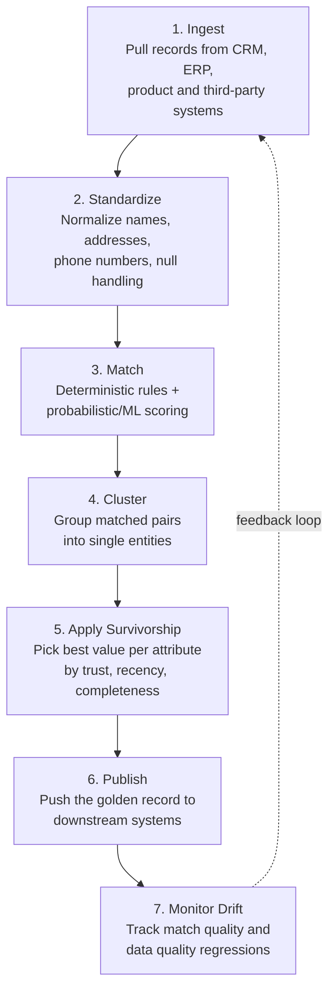
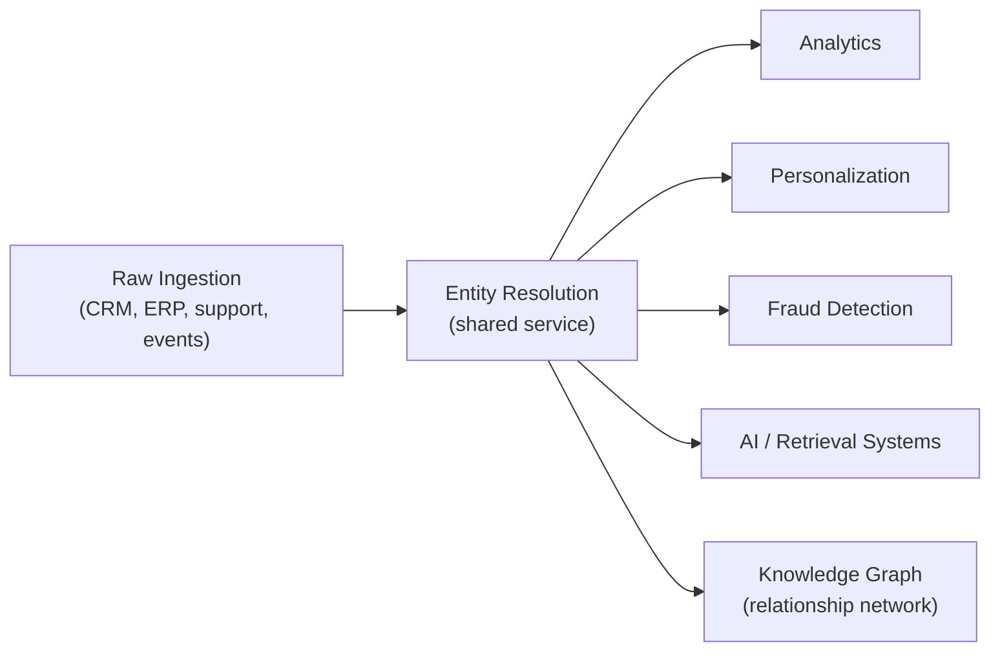
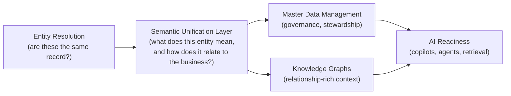

# Entity Resolution in the Enterprise — Notes

Source: "Entity Resolution: Techniques, Tools & Enterprise Use Cases" — Galaxy (getgalaxy.io), April 2026

---

## What We Already Know

From the previous set of notes on entity resolution, the following foundation is already covered:

- Entity resolution identifies when multiple records (e.g., "Robert Smith," "Bob Smith," "R. Smith") describe the same real-world person, despite inconsistent formatting, missing fields, and typos.
- **Deterministic matching** relies on exact shared identifiers (email, government ID) — fast and trustworthy, but only works when a reliable identifier exists.
- **Probabilistic matching** weighs similarity across multiple fields (name, date of birth, address) to compute a match score, mimicking human judgment across a scale no human could manage manually.
- Matching produces three outcomes: confident match, confident non-match, and an uncertain middle zone routed to human reviewers.
- **Blocking** solves the arithmetic problem of comparing every record to every other record (a million records would require roughly half a trillion comparisons) by first grouping plausible candidates (e.g., by ZIP code) and only comparing within each group.
- After a match is found, organizations either **merge** records into one master record or **link** them while preserving the originals.
- Entity resolution is the invisible foundation beneath master data management (MDM) and the single customer view.

This article does not contradict any of that. It builds on top of it — moving from "how matching works" toward "how enterprises operationalize this as a system."

---

## What Is Different in This Article

The previous notes explained entity resolution largely from a conceptual, single-domain (customer identity) angle. This article adds several layers that were not covered before:

1. **A defined end-to-end workflow** — ingest, standardize, match, cluster, apply survivorship, publish, monitor — rather than just "match, then decide what to do."
2. **Entity resolution applied beyond customers** — to products, suppliers, assets, and locations, not just people.
3. **Survivorship and confidence scoring as a distinct concept** — deciding which attribute value "wins" when sources disagree, separate from the matching decision itself.
4. **Batch versus real-time resolution** — a deployment/timing dimension not addressed in the earlier notes.
5. **Where entity resolution sits architecturally** — as a shared service across lakehouse, warehouse, governance, and AI layers, rather than a single-purpose MDM feature.
6. **Business outcomes framed explicitly** — single customer view, golden records, product master data quality, governance/compliance, and AI grounding.
7. **Industry-specific use cases** — healthcare (patient matching), financial services (KYC/AML), retail (loyalty and merchandising).
8. **Vendor landscape and evaluation criteria** — scale, latency, governance, interoperability, explainability, operational overhead — plus a named vendor comparison table.
9. **A comparison framework distinguishing entity resolution from MDM, CDPs, and identity resolution** — four related but distinct concepts that are often conflated.
10. **A forward-looking argument** for entity resolution as part of a broader "semantic data unification" layer feeding knowledge graphs and AI systems, rather than an end in itself.

In short: the earlier notes explain the *mechanics* of matching. This article explains the *system* built around those mechanics inside a real enterprise.

---

## Topic-Wise Navigation

1. [What Entity Resolution Is and Why It Matters](#1-what-entity-resolution-is-and-why-it-matters)
2. [The Entity Resolution Workflow](#2-the-entity-resolution-workflow)
3. [How Entity Resolution Works in Practice](#3-how-entity-resolution-works-in-practice)
4. [Business Outcomes Entity Resolution Enables](#4-business-outcomes-entity-resolution-enables)
5. [Enterprise Use Cases and Examples](#5-enterprise-use-cases-and-examples)
6. [Methods and Technical Considerations](#6-methods-and-technical-considerations)
7. [How to Evaluate Entity Resolution Vendors](#7-how-to-evaluate-entity-resolution-vendors)
8. [Choosing the Right Approach: Standalone ER vs. Semantic Unification](#8-choosing-the-right-approach-standalone-er-vs-semantic-unification)
9. [Entity Resolution vs. MDM vs. CDP vs. Identity Resolution](#9-entity-resolution-vs-mdm-vs-cdp-vs-identity-resolution)
10. [Frequently Asked Questions](#10-frequently-asked-questions)
11. [Summary](#11-summary)

---

## 1. What Entity Resolution Is and Why It Matters

Entity resolution is the process of determining when records from **different systems** refer to the **same real-world thing** — a customer, product, supplier, or asset. It matters because enterprises cannot trust analytics, automation, or AI outputs when this underlying data is fragmented across duplicate and conflicting records.

It is also known as **record linkage**. A single customer might appear as "Acme Inc.," "ACME Incorporated," and "Acme, LLC" across CRM, ERP, billing, and support systems. The goal is not simple deduplication — it is identifying relationships, resolving ambiguity, and building a more complete profile that downstream systems can rely on.

### Why Exact Matching Breaks Down

Duplicate records are rarely simple copies. They typically arise from:

- Disconnected systems built independently over time
- Mergers and acquisitions
- Regional business units operating separately
- Manual data entry
- Changing identifiers over a customer's lifecycle
- Inconsistent data standards across teams

One system may store a legal entity name, another a brand name, and a third a billing contact. Addresses change. Emails are shared. Product attributes are modeled differently by team or geography.

> As a result, exact-match logic breaks quickly, but fully manual cleanup does not scale. This is the central tension the rest of the article addresses.

---

## 2. The Entity Resolution Workflow

The article lays out a defined, repeatable seven-step workflow. This is the most significant structural addition compared to the earlier notes, which focused mainly on the matching step in isolation.

| Step | Purpose | Key detail |
|---|---|---|
| Ingest | Bring source records into a common pipeline | Source IDs and lineage must be preserved for traceability |
| Standardize | Make records comparable | Normalize names, addresses, phone numbers, formats, null handling |
| Match | Decide which records refer to the same entity | Exact keys catch obvious duplicates; fuzzy logic handles messy data |
| Cluster | Roll up all matched pairs into one identity | Multiple pairwise matches are consolidated into a single entity group |
| Apply survivorship | Choose the best value per attribute | Based on trust, recency, and completeness of each source |
| Publish | Make the result usable | The golden record is sent to downstream systems and analytics layers |
| Monitor drift | Keep quality from decaying | Tracks match quality, source changes, and quality regressions over time |

### Why This Matters Beyond Data Hygiene

Poor entity resolution has concrete downstream costs:

- Broken "customer 360" initiatives
- Inflated pipeline counts (the same prospect counted multiple times)
- Fragmented service histories
- Compliance risk
- Unreliable reporting
- Weaker AI outputs, since models trained or grounded on messy data inherit that confusion

---

## 3. How Entity Resolution Works in Practice

### Record Linkage as the Starting Point

In practice, entity resolution begins with **record linkage**: comparing records from CRMs, warehouses, support tools, event streams, and third-party sources. This starts with standardization and parsing — names, addresses, emails, phone numbers, company identifiers, and product attributes are normalized so the system can compare like with like.

From there, matching logic evaluates similarity using:

- **Deterministic matching** — works well when there is a stable key, such as a tax ID or customer ID
- **Probabilistic matching** — better when data is incomplete or inconsistent, because it weighs multiple weak signals together rather than relying on one exact field

### Survivorship and Confidence Scoring

This is a concept the earlier notes did not separate out explicitly. Once candidate matches are identified, the system must decide **what to keep**:

- **Confidence scoring** assigns a probability or match score to each linked pair or cluster, separating high-certainty merges from records that need human review.
- **Survivorship** then determines the "best" value for each individual attribute in the golden record — a different decision from whether two records match at all.

For example, one source system may be the most trusted for a customer's legal name, another for billing address, and another for recent behavioral data. Modern platforms combine **source trust, recency, completeness, and validation status** to choose which value survives into the golden record.

### Batch vs. Real-Time Matching

| Mode | When it is used | Characteristics |
|---|---|---|
| **Batch matching** | Warehouse-scale consolidation, periodic MDM jobs, historical cleanup | Efficient for large volumes; easier to govern |
| **Real-time matching** | Onboarding a customer, screening a vendor, enriching an account before a sales action | Incoming records evaluated against an existing entity graph/index with low latency; returns a match decision and confidence score immediately |

### Where Entity Resolution Sits in Modern Architecture

Entity resolution is no longer treated as just an MDM feature. It increasingly operates as a **shared service** positioned between raw ingestion and downstream consumption — feeding the lakehouse, warehouse, reverse ETL, governance, and AI layers alike.

In graph-oriented architectures, entity resolution also becomes the mechanism that connects records into a persistent network of relationships, rather than a one-time cleanup step.

---

## 4. Business Outcomes Entity Resolution Enables

The article frames four distinct business outcomes. These were only implied, not separated out, in the earlier notes.

### 4.1 Single Customer View

Matching and linking records across CRM, support, billing, product usage, and partner systems so teams understand that "Acme Inc.," "Acme Corporation," and a subsidiary account are the same real-world customer. This improves segmentation, account planning, service handoffs, and revenue reporting — because decisions are based on the customer as it actually exists, not as it appears in one system.

### 4.2 Golden Records

Once duplicates and conflicts are identified, organizations apply survivorship rules, confidence scoring, and stewardship workflows to produce a best-version record for each customer, supplier, product, or location. This becomes the trusted reference point for downstream systems, reducing duplicate outreach, inconsistent reporting, and manual reconciliation.

### 4.3 Product Master Data Quality

Product data is often scattered across ERP, PIM (Product Information Management), supplier feeds, e-commerce catalogs, and regional systems — with inconsistent SKUs, naming conventions, units, and hierarchies. Resolving these records into a coherent product entity improves:

- Catalog accuracy
- Procurement efficiency
- Search and merchandising
- Supply chain reporting

### 4.4 Governance, Compliance, and AI

Governance programs depend on knowing what an entity is, where its data lives, and which record is authoritative. This matters for privacy rights, consent management, auditability, and policy enforcement. The same foundation increasingly matters for AI: models perform better when customer, product, and organizational entities are deduplicated, linked, and grounded in trusted context. Better entity resolution translates into cleaner retrieval, fewer hallucinations caused by conflicting records, and more reliable enterprise AI outputs.

---

## 5. Enterprise Use Cases and Examples

### Customer Data Unification

A B2B company may have one account in Salesforce, several contacts in Zendesk, and multiple billing profiles in NetSuite or Stripe. Entity resolution links these using company name, domain, email, billing address, and account owner, then creates a persistent golden record — allowing sales to see open support issues before renewal calls, finance to spot duplicate invoices, and customer success to measure adoption at the account level.

### Product Data Consolidation

Large manufacturers and retailers manage overlapping product records from ERP systems, supplier catalogs, distributor feeds, and e-commerce platforms. One SKU may appear under different names, package sizes, or supplier-specific codes. Entity resolution clusters these variants into a canonical product entity, then maps attributes such as brand, dimensions, compliance fields, and lifecycle status. In regulated environments (e.g., healthcare and life sciences), consistent product identity is critical for traceability, recalls, and reporting.

### Supplier and Vendor Deduplication

Procurement teams often inherit fragmented vendor masters after acquisitions or regional system rollouts. "Acme Ltd.," "Acme Limited," and "ACME Holdings UK" may represent the same supplier, sitting in separate accounts-payable and sourcing systems. Entity resolution normalizes names, addresses, tax IDs, banking details, and parent-child relationships to reduce duplicate payments, improve spend analysis, and enforce supplier risk controls.

### Industry-Specific Examples

| Industry | Use case | Value delivered |
|---|---|---|
| Healthcare | Patient identity matching across systems | Cleaner master patient indexes; safer care coordination |
| Financial services | KYC and AML workflows | Connects customers, beneficial owners, accounts, and counterparties across onboarding, sanctions screening, and transaction monitoring |
| Retail | Unifying customer profiles across loyalty, e-commerce, POS, and service channels | Cleaner merchandising and inventory decisions, alongside a unified customer profile |

Across all three, the underlying workflow is identical: ingest fragmented records, match and cluster likely duplicates, assign a trusted entity, and push the resolved view back into downstream systems.

---

## 6. Methods and Technical Considerations

### Deterministic vs. Probabilistic (Recap and Extension)

This confirms what the earlier notes established, while adding a governance dimension:

| Method | Strength | Limitation |
|---|---|---|
| Deterministic matching | Fast, transparent, easy to audit | Breaks down when data is incomplete, stale, or formatted differently |
| Probabilistic matching | More resilient in messy environments; weighs multiple weak signals | Requires threshold tuning and stronger governance around false positives and false negatives |

### Rules-Based vs. Machine Learning

A second, separate axis of design choice not covered in the earlier notes:

| Approach | How it works | Trade-off |
|---|---|---|
| Rules-based | Encodes domain knowledge directly — normalize names, standardize addresses, compare aliases, require specific field combinations before merging | Predictable and explicit, but rigid; works best when patterns are known and compliance teams need explicit logic |
| Machine learning | Learns match patterns from labeled examples, or scores candidate pairs using similarity models at scale | Better at ambiguous, semi-structured, and multilingual data, but introduces model drift, training data bias, and explainability challenges |

> In most production environments, the strongest pattern is **hybrid**: deterministic rules for high-confidence joins, probabilistic or ML scoring for ambiguous cases, and a review queue for edge cases.

### Structured vs. Semi-Structured Data

- **Structured sources** (CRM, ERP, MDM tables) support direct field-level comparison and survivorship logic.
- **Semi-structured sources** (JSON documents, support tickets, contracts, web data) require parsing, schema mapping, and feature extraction before matching can even begin.

Across both, accuracy depends on normalization, blocking (to reduce comparison volume — consistent with the earlier notes), threshold calibration, and continuous measurement. Resolution decisions must also be **explainable**: teams need to see why records matched, which attributes contributed, and where confidence is low. Human review remains essential for high-impact merges, regulated workflows, and ongoing quality control.

---

## 7. How to Evaluate Entity Resolution Vendors

This section is new territory relative to the earlier notes, which did not address tooling or procurement.

Enterprise entity resolution is no longer just a matching engine — the best platforms combine high-accuracy resolution with operational fit. Evaluation should start with the **deployment model and decision loop**: some teams need batch unification for customer, supplier, or product master data; others need near-real-time resolution for onboarding, fraud, service, or AI applications.

### Key Evaluation Criteria

| Criterion | Question to ask |
|---|---|
| Scale | Can the platform handle billions of records, frequent updates, and multi-domain resolution without major re-architecture? |
| Latency | Does it support both batch and low-latency/real-time use cases? |
| Governance | Are match rules, lineage, stewardship, auditability, and policy controls built in? |
| Interoperability | Does it integrate with cloud storage, warehouses, MDM, CRM, identity, and AI pipelines through APIs and connectors? |
| Explainability | Can teams understand why records matched, merged, or stayed separate? |
| Operational overhead | How much tuning, data engineering, and specialist support is required to keep quality high? |

### Vendor Comparison (as presented in the article)

| Vendor | Best Fit | Scale | Latency | Governance | Interoperability |
|---|---|---|---|---|---|
| Galaxy | Semantic data unification and enterprise knowledge layers | High | Low-latency capable | Strong | Strong |
| Reltio | Cloud-native MDM and customer/entity resolution | High | Strong | Strong | Strong |
| Informatica | Large enterprises with broad data governance needs | High | Moderate to strong | Very strong | Very strong |
| Tamr | Large-scale data mastering and complex source consolidation | High | Moderate | Strong | Strong |
| Senzing | Fast, explainable resolution for risk, fraud, and operations | High | Strong | Moderate | Moderate to strong |
| AWS Entity Resolution | Cloud-native matching inside AWS ecosystems | Moderate to high | Moderate | Moderate | Strong in AWS |

> Note: This table is presented by Galaxy, the publisher of the source article, and includes Galaxy itself as a vendor. It should be read as a vendor-provided comparison rather than independent, third-party benchmarking.

### The Legacy MDM Gap

A common gap the article highlights: legacy MDM systems were built for **centralized master records**, not **continuous, cross-system resolution**. Older stacks often rely on rigid schemas, batch-heavy processing, brittle match rules, and expensive stewardship queues. They may govern mastered data well but struggle with low-latency activation, multi-hop relationships, and interoperability across modern warehouses, lakehouses, SaaS apps, and AI systems.

> The suggested evaluation question is not "can it match records?" but **"can it resolve entities continuously, govern them safely, and make them usable everywhere?"**

---

## 8. Choosing the Right Approach: Standalone ER vs. Semantic Unification

### When Standalone Entity Resolution Is Enough

Standalone entity resolution is often sufficient when the goal is narrow and operational:

- Deduplicating customer, supplier, or product records across a few systems
- Improving match accuracy for a specific workflow
- Cleaning data before a migration

In these cases, the priority is high-confidence matching, survivorship rules, and measurable improvements in record quality.

### When the Limits Show Up

Large enterprises rarely struggle with duplicate records alone. They struggle with **inconsistent meaning** across systems — different definitions of customer, product, policy, asset, or location; fragmented metadata; and weak context for analytics and AI.

In this framing:

- **MDM** provides control, stewardship, and golden-record discipline
- **Entity resolution** improves identity accuracy inside that process
- **Knowledge graphs** add relationship-rich context that traditional tables often miss

The article's argument is that AI systems preparing for copilots, agents, and retrieval workflows need more than clean records — they need **governed meaning, linked context, and a structure machines can reason over.** This positions entity resolution as one layer within a larger semantic unification strategy, rather than an end goal in itself.

---

## 9. Entity Resolution vs. MDM vs. CDP vs. Identity Resolution

This comparison directly addresses a source of confusion the earlier notes did not touch: several adjacent terms are frequently used interchangeably but refer to different things.

| Approach | Primary Focus | Scope | Best For | Limitations |
|---|---|---|---|---|
| **Entity resolution** | Matches and merges records referring to the same real-world entity, even when data is messy, incomplete, or inconsistent | Broad and domain-agnostic: customers, suppliers, products, locations, organizations | Multi-source data unification where the core question is "are these the same thing?" Especially strong for B2B, operational data, and non-customer entities | Does not by itself provide governance, stewardship, or a full golden-record operating model like MDM |
| **Master data management (MDM)** | Creates a trusted, governed system of record for core business entities: standardization, survivorship, stewardship, hierarchy management, ongoing quality | Enterprise-wide: customer, product, supplier, and location domains; spans processes, policies, workflows | Organizations needing governed golden records across business units, where compliance, ownership, auditability, and operational consistency matter | Heavier to implement and maintain; can be slower to deliver value if the immediate need is only matching/deduplication |
| **Customer data platform (CDP)** | Unifies customer data for segmentation, personalization, activation, and measurement — emphasis on marketing and customer experience | Customer-centric: marketing, sales, service, and digital engagement data; ingests behavioral, transactional, and profile data for activation | Marketing teams needing a usable customer profile for audiences, journeys, and campaign orchestration, where activation speed matters more than enterprise-wide governance | Usually narrower than MDM; not designed to govern every enterprise entity — product, supplier, or complex operational domains are typically out of scope |
| **Identity resolution** | Connects identifiers and interactions belonging to the same person or household across devices, channels, and touchpoints — a specialized form of matching focused on persistent customer identity | Mostly customer/audience identity across anonymous and known states; common in adtech, martech, and customer data stacks | Omnichannel personalization, attribution, suppression, and frequency control — recognizing the same customer across fragmented identifiers | Narrower than general entity resolution, since it centers on people/households and marketing identity graphs; privacy constraints and signal loss can reduce accuracy |

**Bottom line, as stated in the article:**
- Entity resolution = the matching problem
- MDM = the governed master-record operating model
- CDP = customer data unification for activation
- Identity resolution = customer identity stitching across identifiers

---

## 10. Frequently Asked Questions

**How is entity resolution different from record linkage?**
Entity resolution is the broader process of identifying, matching, and consolidating records referring to the same real-world entity. Record linkage is a closely related, narrower technique — usually one step inside a larger entity resolution workflow.

**How does entity resolution enable a single customer view?**
By connecting customer records from CRM, billing, support, product usage, and marketing systems into one trusted profile, making it possible to see the same person or account across touchpoints.

**What is a golden record?**
The most trusted, complete representation of an entity after duplicate and conflicting records have been reconciled. Entity resolution determines which records belong together; survivorship and governance rules then decide which attributes become authoritative.

**Does entity resolution apply only to customer data?**
No. It is equally useful for product, supplier, asset, and location data — for example, unifying duplicate SKUs, inconsistent descriptions, and overlapping catalog entries across ERP, PLM, PIM, and e-commerce systems.

**What does real-time entity resolution mean?**
Matching and updating entity profiles as new records or events arrive, rather than waiting for nightly or weekly batch jobs — important for fraud detection, customer support, and personalization, where context changes quickly.

**How is entity resolution different from MDM, identity resolution, and deduplication?**
Entity resolution decides which records refer to the same entity. MDM adds governance, stewardship, workflows, and hierarchies on top. Identity resolution typically focuses on people and cross-channel identifiers in marketing contexts. Deduplication is narrower still — usually removing obvious duplicates within a single system.

**Why isn't simple deduplication enough?**
Because most enterprise data problems are messier than exact duplication: names change, addresses vary, product codes differ by source, and records may be incomplete or contradictory. Entity resolution uses rules, probabilistic matching, graph relationships, or machine learning to connect records that are related even when they do not look identical.

**What is the cost of poor data quality when entity resolution is missing?**
Duplicate outreach, broken reporting, wasted operations, compliance risk, and unreliable AI outputs — because teams lose trust in dashboards and workflows when the same customer, supplier, or product appears in multiple inconsistent forms.

**How does entity resolution support AI use cases?**
AI systems perform better when underlying entities are clean, connected, and contextualized. Entity resolution improves retrieval, feature quality, grounding, and explainability — resulting in fewer contradictory answers and better enterprise context for models reasoning over customers, products, suppliers, or assets.

**How do teams measure whether entity resolution is working?**
Through both technical and business metrics: precision, recall, false match rate, duplicate reduction, profile completeness, and downstream impact on service, analytics, or conversion. The goal is more trustworthy entity profiles, not simply a higher match count.

---

## 11. Summary

This article extends the foundational understanding of entity resolution (matching logic, deterministic vs. probabilistic methods, blocking, merge vs. link) into an enterprise operating model. The core additions are:

- A concrete seven-step workflow (ingest, standardize, match, cluster, survivorship, publish, monitor) that turns matching into a repeatable, governed process
- Recognition that survivorship (which value wins) is a distinct decision from matching (which records are the same)
- A batch-vs-real-time dimension based on operational need
- Application of entity resolution across customer, product, supplier, and asset domains — not customer identity alone
- A clear vocabulary distinguishing entity resolution from MDM, CDPs, and identity resolution, which are frequently confused
- A vendor evaluation framework (scale, latency, governance, interoperability, explainability, operational overhead)
- A forward-looking positioning of entity resolution as one layer within a broader semantic data unification strategy that also feeds knowledge graphs and AI systems

Together, the two sets of notes now cover both the mechanics of how entity resolution works and the system-level way enterprises deploy, govern, and evaluate it in production.
