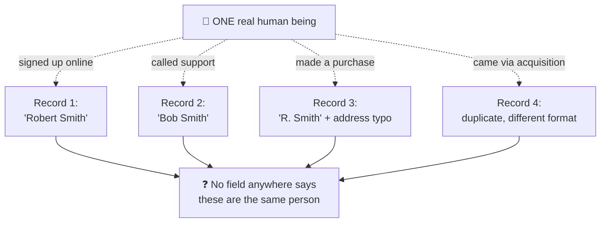
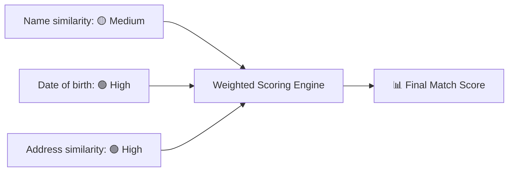
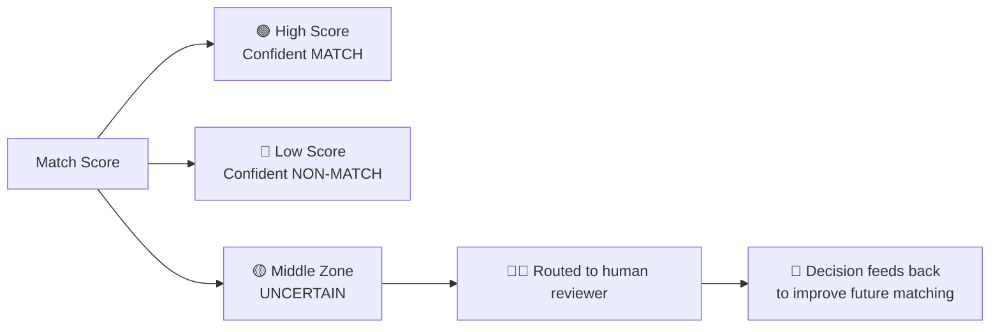
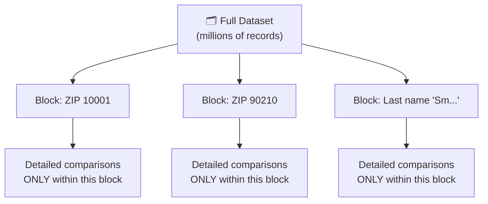
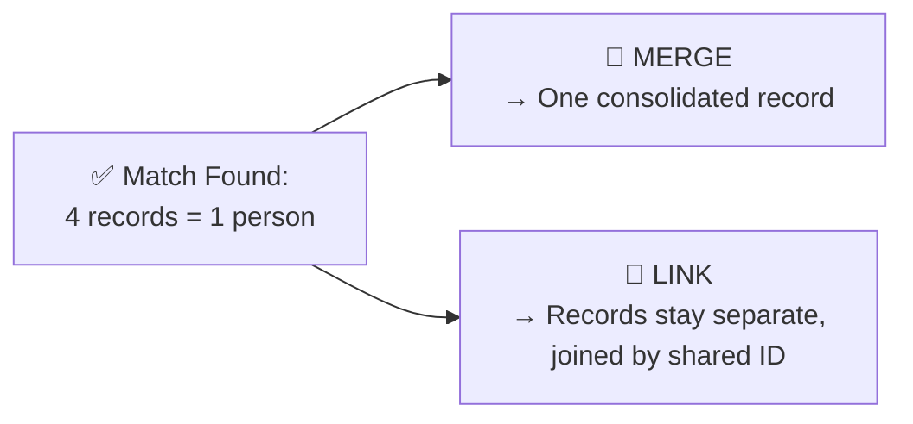
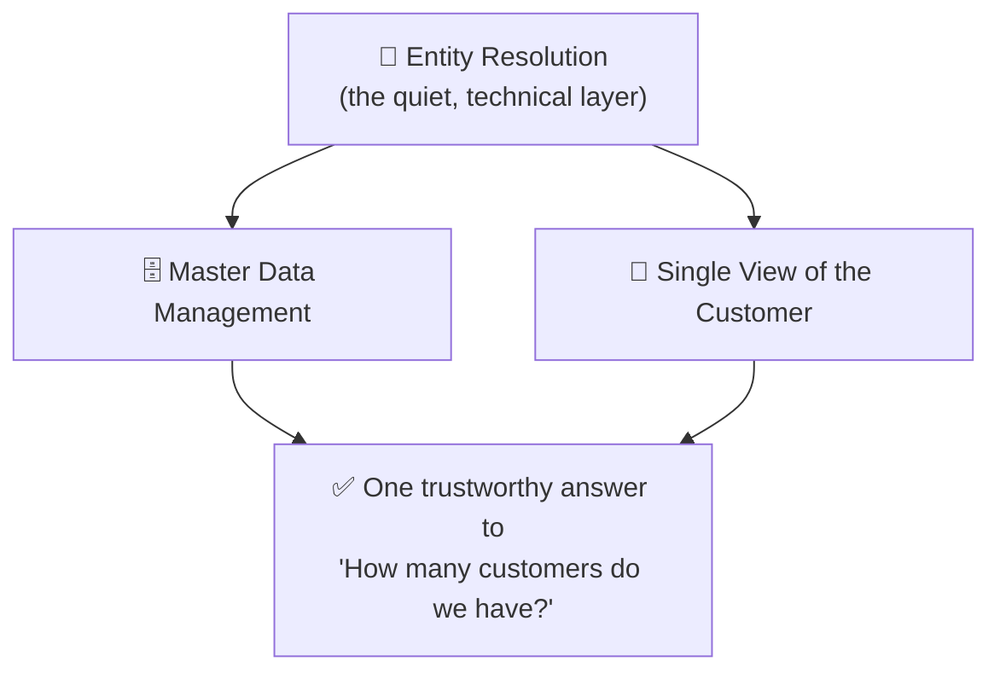
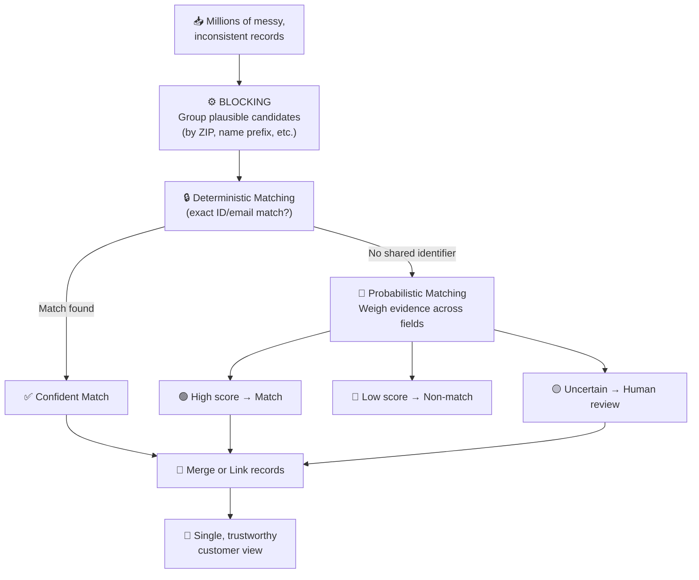

# 🧩 Entity Resolution — Complete Notes

> How organizations figure out that scattered, messy records actually describe the *same* real-world person.

---

## 🗺️ Table of Contents

1. [What Is Entity Resolution?](#1--what-is-entity-resolution)
2. [Why It's Hard — The Core Problem](#2--why-its-hard--the-core-problem)
3. [Approach 1: Deterministic Matching](#3--approach-1-deterministic-matching)
4. [Approach 2: Probabilistic Matching](#4--approach-2-probabilistic-matching)
5. [The Three-Way Outcome (Match / No-Match / Uncertain)](#5--the-three-way-outcome-match--no-match--uncertain)
6. [The Scale Problem & Blocking](#6--the-scale-problem--blocking)
7. [After the Match: Merge vs. Link](#7--after-the-match-merge-vs-link)
8. [Why This Matters — Master Data & Single Customer View](#8--why-this-matters--master-data--single-customer-view)
9. [End-to-End Summary Diagram](#9--end-to-end-summary-diagram)
10. [Big-Picture Takeaways (TL;DR)](#10--big-picture-takeaways-tldr)

---

## 1. 🎯 What Is Entity Resolution?

**Entity resolution** is the process of figuring out that multiple, differently-recorded data entries actually refer to **one and the same real-world entity** (usually a person, sometimes a company) — and doing this reliably across **millions of records**, even when the clues are partial, inconsistent, or flat-out wrong.

### 📋 The Motivating Example

A single customer can exist in a company's systems as **four completely different-looking records**:

| # | Source | How the name appears | Note |
|:---:|---|---|---|
| 1 | Website sign-up | `Robert Smith` | Full formal name |
| 2 | Support call | `Bob Smith` | Nickname used verbally |
| 3 | Purchase record | `R. Smith` | Abbreviated + typo in street address |
| 4 | Acquired competitor's list | `Robert Smith` (different formatting) | Came from an entirely different system |

**The core challenge in one sentence:** *Four records, one human — and nothing that explicitly links them.*

---

## 2. 🧨 Why It's Hard — The Core Problem

The obvious "solution" — just match records that are **identical** — **doesn't work**, because records describing the same person are almost never identical in the real world.

Common sources of messiness:

- ✏️ **Names** get shortened, misspelled, or written with/without a middle initial
- 🏠 **Addresses** change when people move, and get abbreviated differently each time
- ☎️ **Phone numbers** get formatted a dozen different ways
- ⏳ **Information goes stale** over time
- ⬜ **Fields get left blank**

> 💡 **Key insight:** Because exact matching fails, entity resolution has to make **judgment calls about similarity** — not simple yes/no comparisons. That's what makes it a genuinely hard, clever problem rather than a simple lookup.

---

## 3. 🔒 Approach 1: Deterministic Matching

**Deterministic matching** works on **firm, rule-based logic**:

> *"If two records share the same [unique identifier], they're the same person."*

### ✅ How it works
| Shared field | Verdict |
|---|---|
| Same email address | → Same person |
| Same government ID number (e.g. SSN) | → Same person |

### 👍 Strengths
- ⚡ **Fast**
- 🧠 **Easy to understand**
- ✅ **Highly trustworthy** — when a reliable shared identifier exists, there's little room for doubt

### 👎 Weakness
Reliable identifiers are **often missing or inconsistent**:
- Not every record has an email
- People **share** email addresses with family members
- Someone **mistypes** a digit in an ID number
- Records from **different systems built at different times** were often never designed to share any common identifier at all

> ⚠️ **Bottom line:** Deterministic matching **catches the easy cases** and **leaves the hard ones completely untouched**. It's necessary, but not sufficient on its own.

---

## 4. 🎲 Approach 2: Probabilistic Matching

This is where entity resolution gets genuinely interesting — it's built for exactly the hard cases deterministic matching can't handle.

### 🧠 The Core Idea

Instead of demanding an exact match on **one** field, probabilistic matching:
1. Looks across **many fields at once**
2. **Weighs the evidence** from each field
3. Computes a **probability score** that two records refer to the same entity

> It treats matching as a question of **accumulated probability**, not a rigid yes/no rule.

### 🧑‍🤝‍🧑 Worked Example

Compare:
> `"Robert Smith, born March 1985, living at 42 Oak Street"`
> `"Bob Smith, born March 1985, living at 42 Oak St"`

No single field matches **character-for-character** — yet a human would instantly conclude these are the same person. Why? Because you're **weighing evidence holistically**:

| Field | Record A | Record B | Match Quality |
|---|---|---|---|
| Name | Robert Smith | Bob Smith | 🟡 Similar (nickname) |
| DOB | March 1985 | March 1985 | 🟢 Exact match |
| Address | 42 Oak Street | 42 Oak St | 🟢 Effectively identical |

**➡️ Combined evidence = high-confidence match**, even with zero perfect field matches.

> 💡 **In plain terms:** Probabilistic matching is a way of teaching a computer to reason the way a human naturally would — just applied across **millions of comparisons** no person could ever do by hand.

---

## 5. 🚦 The Three-Way Outcome (Match / No-Match / Uncertain)

Probabilistic scoring doesn't just produce a binary answer — it naturally creates **three possible outcomes**:

| Zone | Meaning | What happens |
|:---:|---|---|
| 🟢 **High score** | Strong evidence of match | Confidently merged/linked automatically |
| 🔴 **Low score** | Strong evidence of *no* match | Confidently kept separate |
| 🟡 **Middle zone** | Suggestive but not conclusive | Sent to a **human reviewer** for a final call |

> ⚙️ **The system design here is elegant:** the machine handles massive volume, the human handles genuine ambiguity, and over time the human's borderline decisions can be **fed back into the system** to sharpen future automated matching.

---

## 6. ⚙️ The Scale Problem & Blocking

Even with a great matching method, there's a **hard arithmetic obstacle** before any of this can run in the real world.

### 🔢 The Math Problem

> Comparing **every record against every other record** explodes in cost almost immediately.

| Number of records | Total possible pairwise comparisons |
|:---:|:---:|
| 1,000,000 | ≈ **500,000,000,000** (half a trillion!) |

No system — no matter how powerful — can afford to run half a trillion detailed comparisons. This is not a "nice to have" optimization problem; it's a **hard wall**.

### 🧊 The Fix: Blocking

**Blocking** solves this by first sorting records into **rough candidate groups** that could *plausibly* match — for example:
- Records sharing the same **zip code**
- Records sharing the same **first few letters of a last name**

Only records **within the same block** ever get the expensive, detailed comparison.

> ⚖️ **Trade-off:** Blocking accepts a **small risk of missing an unusual match** (e.g., someone who moved and changed both name and ZIP) in exchange for an **enormous gain in speed**.
>
> 🚨 **Without blocking, entity resolution at real-world scale simply isn't feasible.**

---

## 7. 🔀 After the Match: Merge vs. Link

Finding the matches is only half the job. Once you know four records belong to one person, the organization has to **decide what to actually do about it**.

> **Discovery** = recognizing the four records are the same person.
> **Resolution** = acting on that recognition.

| Strategy | What happens | Best when... |
|---|---|---|
| 🧬 **Merge** | Records are consolidated into **one single master record** | You want one clean, simplified record and don't need to preserve every original source separately |
| 🔗 **Link** | Original records **stay in place**, but get connected via a **shared identifier** | You need to preserve source data for **audit or operational** reasons |

> 📌 **Both approaches are common in practice.** The right choice depends entirely on how much the *original* records need to be individually preserved.

---

## 8. 🏢 Why This Matters — Master Data & Single Customer View

Entity resolution isn't an academic exercise — it's the **hidden machinery** underneath two things almost every large organization wants:

1. 🗄️ **Master Data Management (MDM)**
2. 👤 **Single View of the Customer**

### The Big Question It Answers
> *"How many customers do we actually have?"*
> *"What do we actually know about this one person?"*

Neither question can be honestly answered **unless** the organization can first recognize when scattered records describe the same underlying entity.

> 💬 **Key line to remember:** *It's quiet, technical work that rarely gets attention — but the clean, unified customer view executives ask for is **impossible** without it.*

---

## 9. 🔄 End-to-End Summary Diagram

---

## 10. 🎓 Big-Picture Takeaways (TL;DR)

> - **The problem:** One person often exists as multiple inconsistent records across different systems, with no field linking them.
> - **Why it's hard:** Real-world data is messy — names, addresses, and phone numbers rarely match exactly, so **exact matching fails**.
> - **Deterministic matching:** Fast and trustworthy, but only works when a reliable shared identifier (email, ID number) exists — misses everything else.
> - **Probabilistic matching:** Scores similarity across *multiple* fields at once, mimicking human judgment — this is what handles the "hard" cases.
> - **Three outcomes, not two:** Confident match · confident non-match · **uncertain middle zone**, which gets routed to human reviewers (whose decisions can improve the system over time).
> - **The scale problem:** Comparing every record to every other record is computationally impossible at real-world volume (½ trillion+ comparisons for 1M records).
> - **The fix:** **Blocking** — group plausible candidates first (e.g., by ZIP code), then only compare within each group. Trades a small accuracy risk for a massive speed gain.
> - **After a match, two choices:** **Merge** into one master record, or **Link** while preserving the originals — the right choice depends on audit/operational needs.
> - **Why it matters:** Entity resolution is the invisible foundation beneath **Master Data Management** and the **Single Customer View** — without it, "How many customers do we have?" has no honest answer.

---

*📚 Notes based on: "Entity Resolution: How Organizations Figure Out That Two Records Are the Same Person" (Blog Home).*
